# 🛒 Ecommerce Website for Easy Purchase Product


Welcome to **ShopCart** – a modern, full-featured ecommerce web application built with Django! 🚀

---

<p align="center">
  
</p>

---

## ✨ Features

- 🔐 **User Authentication**: Sign up, sign in, sign out, password reset, and profile management.
- 🛍️ **Product Catalog**: Browse, search, and filter products by category.
- 🛒 **Cart Management**: Add to cart, update quantities, and checkout.
- 💖 **Wishlist**: Save your favorite products for later.
- 📦 **Order Placement**: Place orders and view your order history.
- 👤 **Profile Page**: Edit profile, change/reset password, and view quick stats.
- 🛠️ **Admin Panel**: Manage products, categories, carts, and wishlists.
- 📱 **Responsive UI**: Clean, modern, and mobile-friendly interface.

---

## 🖼️ Working of Website:
# 1. Home page : 

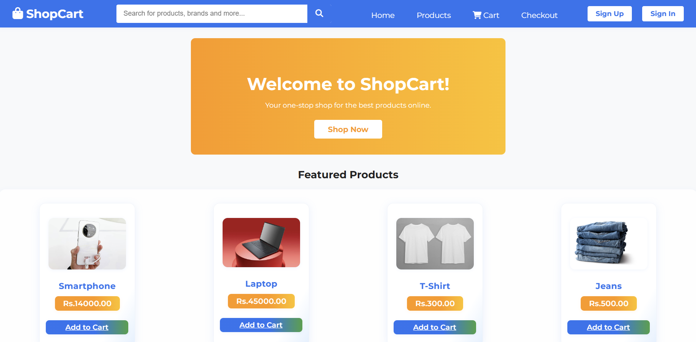

# 2.Signup and Sigin:
 1.Sigupage:
 
  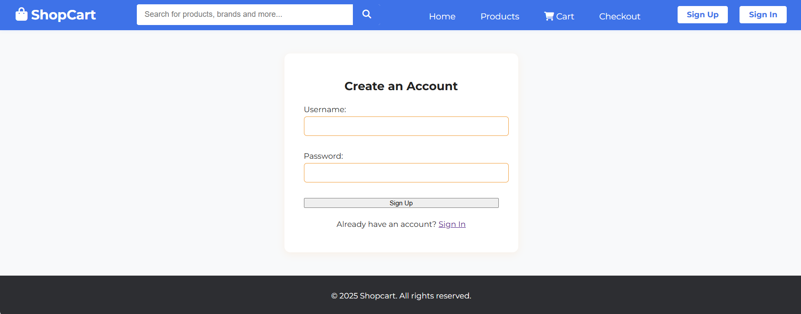
  
 2.sigin:
 
 

# 3. product page:

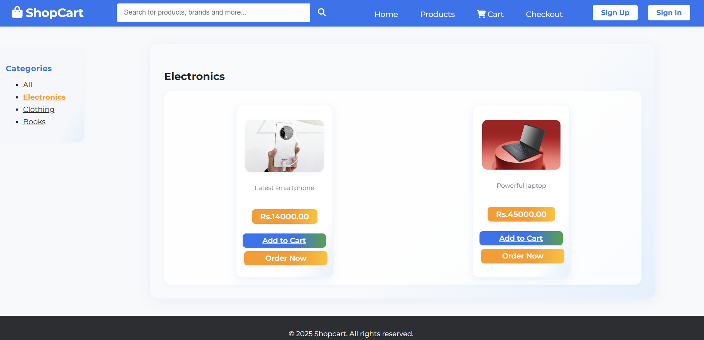
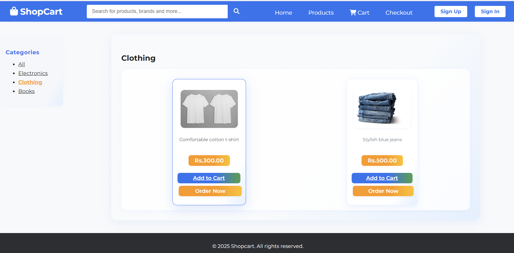
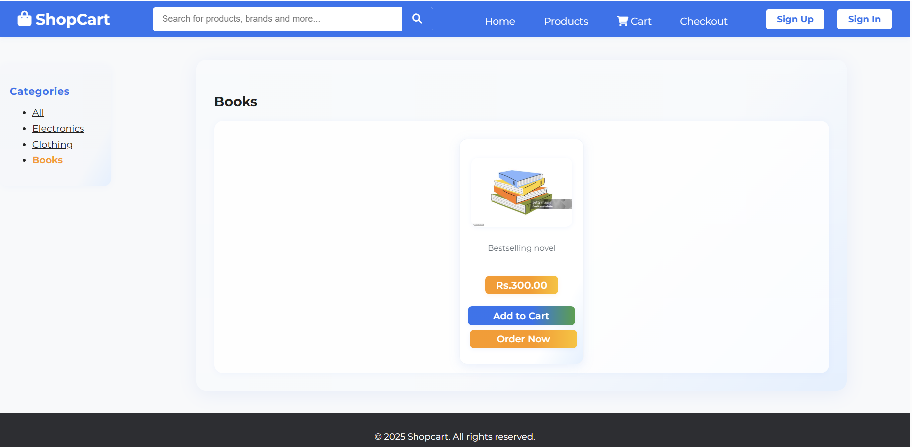
# 4. cart page:
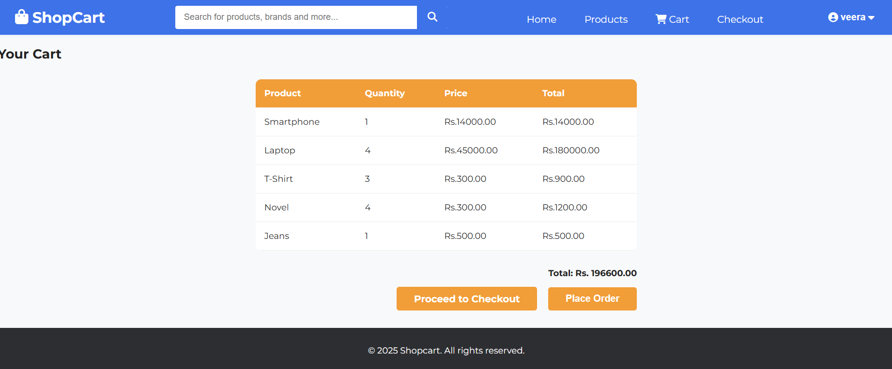
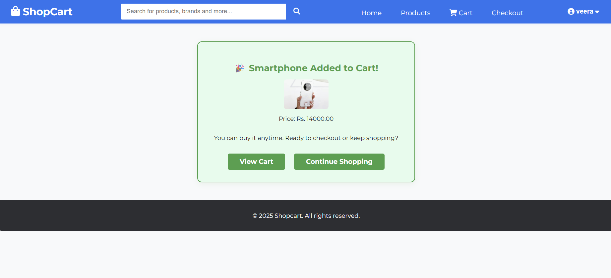

# 5.whislist :
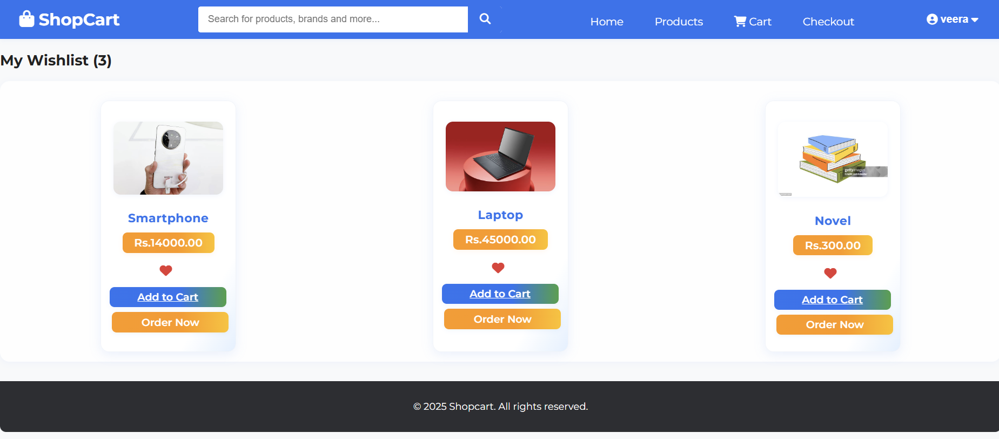

# 6.checkout page:
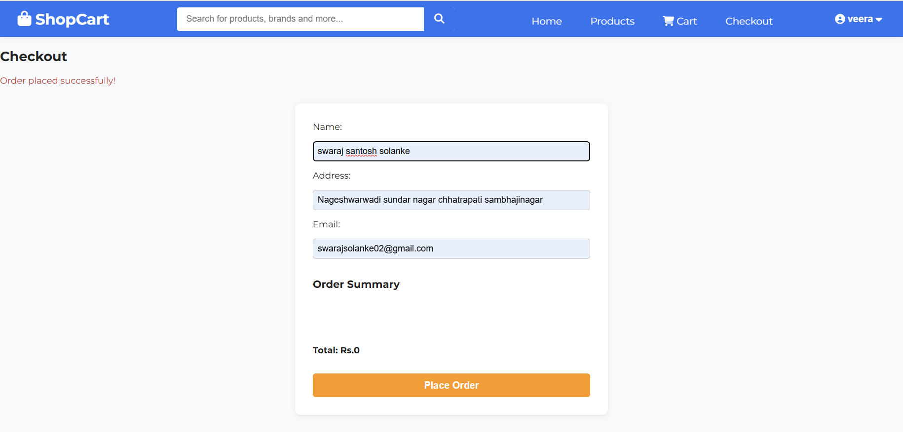
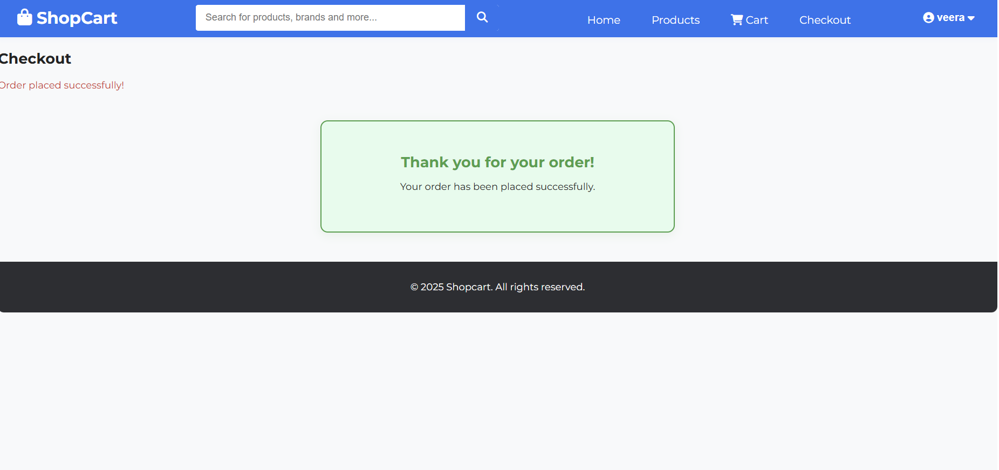

# 7.order page:
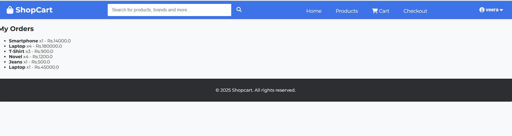

# 8.profile section:
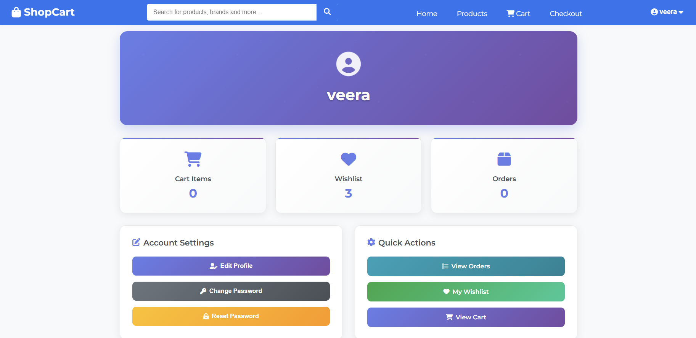

# 9.Edit profile:
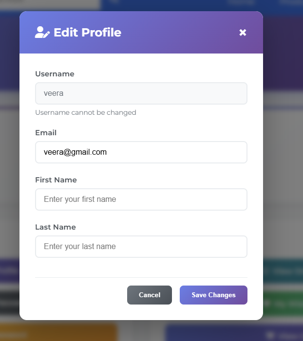

# 10.change password:
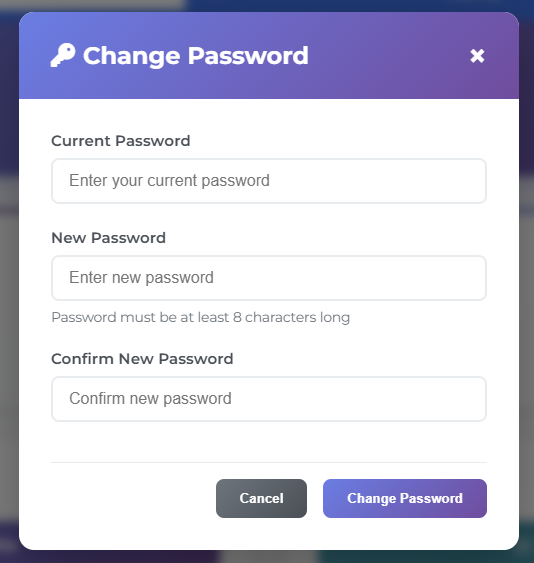

# 11.Reset password:
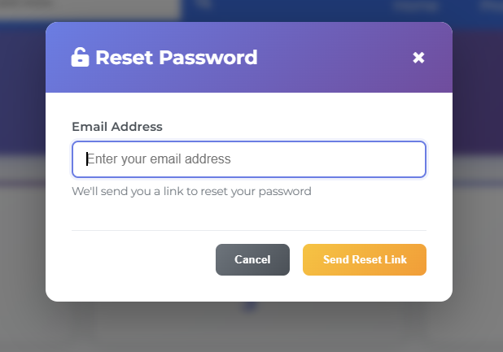


## Project Structure

```text
ecommerce/
├── db.sqlite3
├── ecommerce/
│   ├── settings.py
│   ├── urls.py
│   └── ...
├── manage.py
└── store/
    ├── admin.py
    ├── models.py
    ├── views.py
    ├── urls.py
    ├── templates/
    ├── static/
    └── ...
```

---

## Quick Start

1. **Clone the Repository**
    ```bash
    git clone https://github.com/Swarajsolanke/ecommerce.git
    cd ecommerce
    ```
2. **Create a Virtual Environment**
    ```bash
    python -m venv venv
    # On Windows:
    venv\Scripts\activate
    # On Mac/Linux:
    source venv/bin/activate
    ```
3. **Install Dependencies**
    ```bash
    pip install django
    ```
4. **Apply Migrations**
    ```bash
    python manage.py migrate
    ```
5. **Create a Superuser**
    ```bash
    python manage.py createsuperuser
    ```
6. **Run the Server**
    ```bash
    python manage.py runserver
    ```

---

## 📝 Usage

- **Home**: View featured products and navigate to the catalog.
- **Products**: Browse, search, and filter products.
- **Cart**: Add/remove products, update quantities, and checkout.
- **Wishlist**: Save products for later.
- **Orders**: View your order history.
- **Profile**: Manage your account and password.
- **Admin**: `/admin/` for product/category management.

---

## 📂 Static & Media Files

- Static files (CSS, images): `store/static/`
- Product images: `store/static/images/`

---

## 🙌 Credits

- Built with [Django](https://www.djangoproject.com/)
- UI inspired by modern ecommerce platforms
- Icons by [Icons8](https://icons8.com/)

-----

<p align="center">
  <b>Happy Shopping! 🛒</b>
</p>
